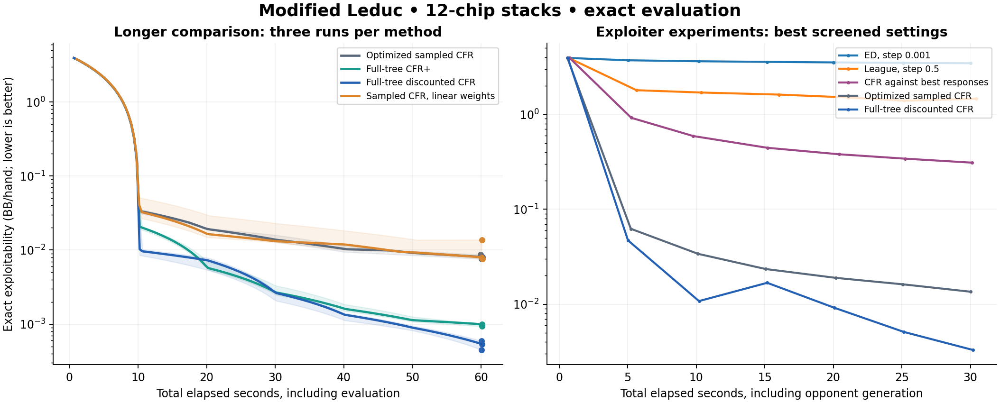
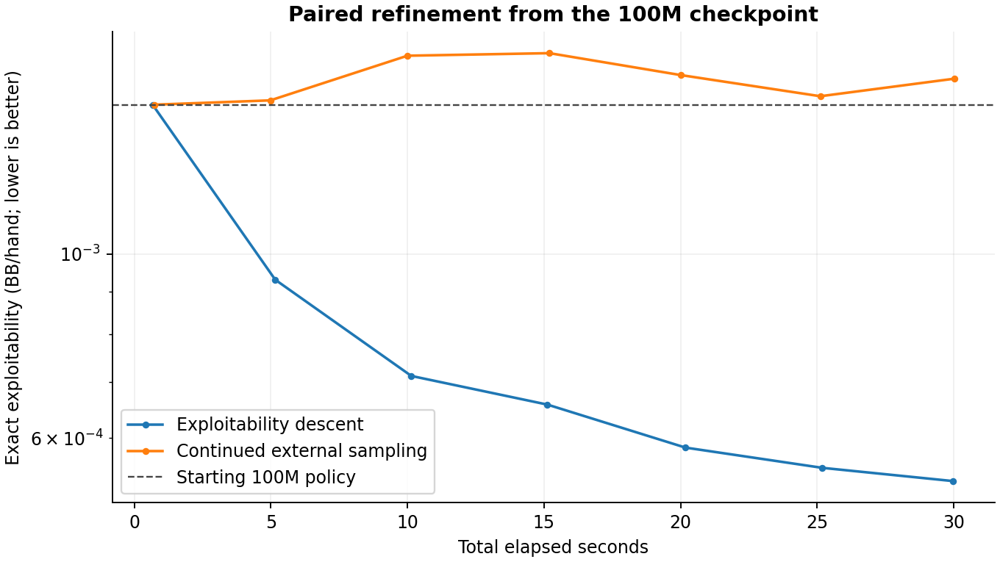
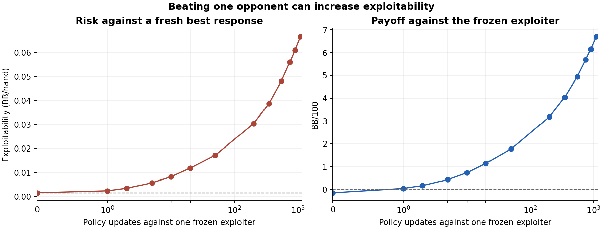

# Training optimization sweep: results

This note summarizes the short, exact-evaluation experiments run on the project's
12-chip modified Leduc game. They compare training quality at a fixed wall-clock
budget; iteration counts are not comparable because one method's iteration can
do much more work than another's.

## Main result

Native full-tree DCFR with parameters `(alpha, beta, gamma) = (1.5, 0, 2)` was the
strongest tested method. In roughly 60 seconds per run, its exact exploitability
was `0.000447–0.000592 BB/hand`; CFR+ reached `0.000930–0.000997`, while
external-sampling MCCFR reached `0.007548–0.008620`.

| Method | 60-second results | Run type |
|---|---:|---|
| Full-tree DCFR | 0.000447–0.000592 BB/hand | Three deterministic timing repeats |
| Full-tree CFR+ | 0.000930–0.000997 BB/hand | Three deterministic timing repeats |
| External-sampling MCCFR | 0.007548–0.008620 BB/hand | Three stochastic seeds |
| Sampled linear weighting | 0.007641–0.013778 BB/hand | Three stochastic seeds |

The full-tree methods are deterministic; the supplied `seed` is unused by them.
Their three runs measure repeatability of timing and stopping checkpoints, not
independent strategy seeds. Evaluation ran about every ten seconds, so threshold
times are only the first observed checkpoint, not exact crossing times.

The sampled pilot also tried baseline-corrected external sampling. At 30 seconds
and one seed, plain external sampling reached `0.01355`, sampled linear weighting
`0.01415`, baseline correction `0.01680`, and their combination `0.01516`. These
short results do not support the extra sampled variants.

## Exploiter training

The native exploitability-descent (ED), retained-opponent league, and CFR-best-
response prototypes were each given a 60-second run from a uniform policy. At the
default step size, their final exploitabilities were respectively `0.2093`,
`0.4782`, and `0.1748 BB/hand`. This is poor relative to DCFR and external MCCFR;
those three prototypes also received only one run each.

I then screened smaller ED/league step sizes warm-started from the 100M Rust
checkpoint (`0.0015126 BB/hand`) for 20 seconds. The best ED setting tested was
`0.01`, ending at `0.0018927`. League step sizes `0.01`, `0.05`, and `0.1` ended at
`0.00992`, `0.04228`, and `0.06238`. Continuing external sampling from the same
checkpoint ended at `0.0016311`. This one-seed screen does not show that the
exploiter approach improves on self-play. It also does not rule out a better
league schedule, update rule, or tuning.

The league implementation does implement the core proposal: periodically compute
fresh exact best responses, retain a bounded opponent pool, and train against
whole frozen opponents interleaved with self-play. Its projected-update schedule
is heuristic and has no claimed convergence guarantee. ED and the league should
remain experimental; their updates currently move away from a very low-
exploitability warm start in these screens.

A separate 30-second warm-start step-size screen provides a useful exception:
starting from the 100M model (`0.0015126`), ED with step `0.001` ended at
`0.0005365`, while the best ED step tested in the 20-second screen ended at
`0.0018927`. The longer screen also found that ED steps that were too large
degraded the checkpoint, and both retained-opponent league settings tested
degraded it. This is promising one-seed evidence for ED as a refinement pass,
not evidence that ED is robust or better across seeds.

I followed this with matched 30-second runs from three independent 2M MCCFR
checkpoints and one paired control from the old 100M model. ED used step `0.001`;
the control continued Rust external sampling. All methods started from the same
checkpoint within each pair.

| Starting checkpoint | Start exploitability | ED after 30s | Continued MCCFR after 30s | ED vs MCCFR |
|---|---:|---:|---:|---:|
| 2M, seed 42 | 0.02330 | 0.01039 | 0.00982 | −0.315 BB/100 |
| 2M, seed 43 | 0.02492 | 0.01300 | 0.01169 | −0.353 BB/100 |
| 2M, seed 44 | 0.02336 | 0.01021 | 0.01068 | −0.214 BB/100 |
| 100M, seed 42 | 0.001513 | 0.000532 | 0.001626 | +0.016 BB/100 |

The matchup column is an exact, seat-balanced expected value for the ED policy
against the paired MCCFR policy; it has no card-sampling error. ED improved all
four starting policies by exploitability, but MCCFR beat ED directly on all three
2M pairs. On the single 100M pair ED had lower exploitability and a very small
head-to-head edge. This supports ED as a possible late refinement of a strong
checkpoint, not as a general replacement for continued MCCFR. One 100M pair is
too little evidence to call that edge reliable.

## One exploiter and batched self-play

To test a simpler version of the opponent-training idea, I kept just one fresh
exact best response per seat. The policy either trained solely against that
exploiter, alternated complete exploiter and self-play updates, or combined
their separately computed counterfactual scores into each update. The last
choice is a whole-opponent batch objective, not a row-wise mixture of policies.
The exploiter was recomputed every 1, 10, or 50 policy updates. The `refresh=1`,
`self-play=0` case is exactly the ED update and has a parity regression test.

From the 100M checkpoint, with step `0.001` and 30 seconds each:

| Update schedule | Exact exploitability | Matchup vs ED |
|---|---:|---:|
| ED, fresh response each update | 0.000532 | reference |
| One exploiter, refresh 10, no self-play | 0.001522 | −0.043 BB/100 |
| One exploiter, refresh 50, no self-play | 0.005698 | −0.227 BB/100 |
| Refresh 10, alternate 25% self-play updates | 0.001045 | −0.019 BB/100 |
| Fresh response, batch 25% self-play in each update | 0.000520 | +0.0008 BB/100 |
| Refresh 10, batch 25% self-play | 0.001121 | −0.024 BB/100 |
| Refresh 10, batch 50% self-play | 0.000805 | −0.0057 BB/100 |

The fresh batch was effectively tied with ED on this one strong checkpoint.
Keeping an exploiter stale caused much larger weakness despite allowing more
updates in the same time. Self-play helped the stale-opponent schedules, but
none beat the fresh-response baseline here. Exact matchup values have no card
sampling error, yet a `+0.0008 BB/100` edge is too small to infer a useful
general advantage from one model pair.

I then gave the fresh 25%-self-play batch 30 seconds from each independent 2M
checkpoint. Its exploitabilities were `0.01113`, `0.01376`, and `0.01097` for
seeds 42–44, slightly above ED's `0.01039`, `0.01300`, and `0.01021`. The batch
beat ED directly by only `0.003–0.008 BB/100`, while continued MCCFR beat the
batch by `0.214–0.348 BB/100` across the same three starts. The batch method
does not show a robust improvement over ED or MCCFR at these settings.

The batch and single-exploiter schedules above recompute *exact* exploiters.
I also tested a distinct, gradually learning exploiter. It began at the
100M checkpoint's exact best response, then the main policy and exploiter
updated simultaneously from each prior state. With 25% batched self-play,
no exact refresh during the 30-second run, and exploiter step multipliers of
`1` and `10`, final exploitability *rose* from `0.001513` to `0.03325` and
`0.03310` respectively. Both resulting policies lost about `0.031 BB/100`
to the starting policy. A 100-iteration diagnostic using multipliers `10`,
`100`, and `1000` still left the learned exploiter roughly
`0.034–0.037 BB/hand` behind a fresh exact best response in each seat. This
naive learner could not track the weaknesses it was supposed to train against.
It does not rule out a more capable opponent update or periodic exact re-solving.

## When to stop training against one exploiter

I tested the proposed rule of training against a single fixed exploiter until
the deployed policy wins against it. The starting 100M policy faced a frozen
pair of exact best responses, one for each seat. With step `0.001` and no
self-play, exact seat-balanced results were:

| Updates against frozen exploiter | Matchup vs frozen exploiter | Exact exploitability |
|---:|---:|---:|
| 0 | −0.151 BB/100 | 0.001513 |
| 1 | +0.039 BB/100 | 0.002342 |
| 5 | +0.426 BB/100 | 0.005644 |
| 50 | +1.772 BB/100 | 0.017193 |
| About 30 seconds, 1,101 updates | +6.702 BB/100 | 0.066623 |

The policy learned to beat that exploiter almost immediately, yet became
easier for a *new* best response to exploit. In this tiny game the matchup is
an exact expectation, so a higher confidence level would not fix the stop
criterion: it measures certainty about one frozen opponent, not safety against
new opponents. Beating the current exploiter is useful as a signal to refresh
it, but any checkpoint-selection rule also needs fresh-response exploitability
or another independent opponent test.

I also ranked information sets by their exact counterfactual action-value
improvement against the frozen responder, weighted by the defending player's
own reach. A direct one-information-set policy change confirmed the top
predicted payoff improvement against that frozen opponent to floating-point
precision. This identifies *where a response to the current exploiter would
pay off*; it is not a decomposition of true exploitability. The large local
gains against a fixed responder explain why repeating updates against it
overfits. For targeted training, refresh the responder after small changes and
check exact exploitability, rather than replaying terminal wins or losses.

## Execution optimization

Separately, changing the Rust MCCFR hot loop to reuse bounded stack arrays and
precompute chance-sampling cumulative weights reduced median kernel time from
`1.3913 s` to `0.7921 s` for the same pre-serialized 100,000-iteration input
(`1.76x`). Exact native state parity was checked through that workload. A
`target-cpu=native` build showed no reliable additional gain. This is a kernel-only
measurement, excluding Python serialization and process launch.

The full-tree Rust kernel then received a separate scratch optimization: flatten
per-information-set strategy vectors, reuse a single strategy and delta buffer,
and use a bounded stack array for action values. Five alternating 20-iteration
DCFR runs measured `0.5525 s` for the current kernel and `0.3609 s` for the
optimized kernel (`1.53x`); all outputs were byte-identical. This change is now
in the experimental kernel and its Python/native parity tests cover all three
variants. The fixed stack buffer is guarded by an action-count assertion for
this compiled game.

## Look-ahead batches of counter-exploiters

The `counterbatch` experiment tests a short version of the proposed cycle.
Each deployed update starts at the current policy, computes its exact best
response pair, takes a provisional ED step, computes another response pair,
and optionally repeats. It then resets to the original policy and makes one
update using the average counterfactual action scores against the complete
response pairs. No exploiter is kept stale across deployed updates. The
one-response setting is exactly ED. All comparisons below include response
generation, policy updates, and exact evaluations in the same wall-clock cap.

One provisional step from the 100M MCCFR policy raised exploitability from
`0.001513` to `0.002342`. The new responses differed at 922 of 44,574 P0
information sets and 3,514 of 45,405 P1 information sets; against the
provisional policy, they gained `0.00242` and `0.00305` BB/hand, respectively,
over the old responses. Thus the second response does expose a different
weakness. It is not merely a duplicate of the first.

From that 100M checkpoint, with step `0.001` and 30 seconds each:

| Responses per update | Final exploitability | Matchup versus one response |
|---:|---:|---:|
| 1 (ED control) | 0.000561 | reference |
| 2 | 0.000582 | −0.0020 BB/100 |
| 3 | 0.000580 | −0.0031 BB/100 |
| 4 | 0.000674 | −0.0057 BB/100 |

Two-response step sizes `0.002` and `0.003` gave `0.000594` and `0.000825`;
adding 25% self-play at step `0.001` gave `0.000599`. These did not improve
on the one-response control. On a stronger full-tree DCFR start
(`0.000447`), the one- and two-response methods at step `0.0005` ended at
`0.0002333` and `0.0002346` after 20 seconds when rerun with the optimized
two-response kernel. The two-response policy won their exact direct matchup
by only `0.00035 BB/100`, a negligible edge. An earlier one-response run at
the same step reached `0.000220`, illustrating run-to-run timing and update
count sensitivity. A two-response result at step `0.001` reached `0.000277`.

The equal batch did not establish a wall-clock advantage. I then weighted the
two responses geometrically. Growth `0.5` gives the first response twice the
weight of the second; growth `2` does the reverse. On the 100M policy, growth
`2` reached `0.000682` at 20 seconds, worse than growth `0.5` at `0.000579`.
In a final matched run with the redundant first provisional score pass removed:

| Starting policy and budget | ED, one response | First-heavy, two responses | First-heavy vs ED |
|---|---:|---:|---:|
| 100M MCCFR, 30 s, step 0.001 | 0.000536 | 0.000530 | +0.00011 BB/100 |
| DCFR checkpoint 42, 20 s, step 0.0005 | 0.000220 | 0.000203 | +0.00142 BB/100 |
| DCFR checkpoint 7, 20 s, step 0.0005 | 0.000290 | 0.000265 | +0.00164 BB/100 |
| 2M MCCFR checkpoint 43, 20 s, step 0.001 | 0.013635 | 0.014363 | −0.01341 BB/100 |

Both DCFR checkpoints are points on the same deterministic training trajectory,
so they are not independent random-seed replications. The 100M gain is tiny;
the two DCFR gains are modest; the less mature MCCFR start lost ground. These
measurements suggest that a small, first-heavy counter-response component can
help refine a mature policy, while applying it early can waste wall-clock time.
They do not establish a convergence guarantee or a reliable improvement across
independent mature policies. A useful next test would gate the look-ahead batch
by measured progress and replicate on more independently trained mature starts.

## Existing-policy population probe

Before training separate population members, I tested whether policies already
produced by the sweep have complementary weaknesses. A root-level mixture of
whole policies was converted to a realization-equivalent behavioral policy
using each member's own-reach weight at each information set. Against a fixed
opponent, the converted strategy's expected value matched the explicit
whole-policy mixture to floating-point precision. This avoids the incorrect
interpretation of averaging action rows independently within a hand.

The strongest member, the first-heavy refinement of DCFR checkpoint 42, had
exact exploitability `0.000203`. Giving it 75% of the mixture and 25% to each
of the following policies produced:

| Other policy | Other policy alone | 75% best + 25% other |
|---|---:|---:|
| Refined DCFR checkpoint 7 | 0.000265 | 0.000218 |
| Refined 100M MCCFR | 0.000530 | 0.000279 |
| Original DCFR checkpoint 42 | 0.000447 | 0.000245 |

The 25/75 and 50/50 splits were also worse than the best member. These are
existing, mostly related policies; this probe does **not** rule out a
purposefully diverse population. It does show that training many ordinary
self-play copies and merging them later has no demonstrated benefit here.
Population members would need distinct training objectives or responses, and
each addition should be accepted only if the resulting mixture improves exact
exploitability at an equal wall-clock cost.

## Method and limits

- All strategy-quality measurements use the exact best-response evaluator over
  the project's modified Leduc game and are in big blinds per hand. Lower is
  better. The evaluator accounts for hidden cards.
- The 60-second finalist runs started from a uniform policy. Their reported
  elapsed budgets include solver initialization and periodic exact evaluations;
  shared build and game-tree compilation were done before the runs. Each run may
  exceed its budget slightly to finish a block/evaluation.
- The warm-start screen used the same saved 100M checkpoint for every method and
  included exact evaluation and solver advancement in the elapsed budget.
- Full-tree DCFR has Python/Rust parity and analytic discount-factor tests, but it
  has not yet been checked against an independent DCFR reference implementation.
  Treat it as a promising experimental implementation, not a certified canonical
  reproduction of every DCFR convention.
- Full-tree traversal is viable for this small compiled Leduc game. These results
  say nothing about its cost or advantage on Texas Hold'em.
- Exact head-to-head results cover the historical checkpoint, paired
  continuations, and a fixed exploiter. They do not establish performance
  against a broad population of unseen opponents or a different poker game.

## Recommendation

For this Leduc benchmark, investigate DCFR further: verify its recurrence against
an independent reference, add resumable checkpoints, and compare longer runs at
equal elapsed time against the production Rust MCCFR. The validated allocation
reductions are worthwhile for both Rust kernels. Test ED as a checkpoint
refinement pass over several seeds and step sizes before adopting it; do not
promote the current league prototype on this evidence. A win against one
frozen exploiter is insufficient as a stopping rule; evaluate against a fresh
best response after each short refinement block and keep only policies that
meet the chosen robust metric. None of these results replaces the separate
Hold'em engine and abstraction work needed to train Texas Hold'em.

For population work, first test a small, purposefully diverse set against a
continued single-solver control; existing-policy mixtures did not improve the
best member. The first-heavy two-response batch is a promising late-stage
refinement candidate, but its gains are small and it lost on a less mature
checkpoint.

## Raw experiment data

The run summaries and per-checkpoint metrics are available alongside this
project in the shared Codex output directory:

- `outputs/optimization-sweep/pilot/` — 30-second variant screening.
- `outputs/optimization-sweep/finalists/` — 60-second CFR and sampled comparison.
- `outputs/optimization-sweep/adversarial-finalists/` — 60-second ED, league, and
  CFR-best-response comparison.
- `outputs/optimization-sweep/warm-adversarial-pilot/` — 20-second ED/league
  step-size screen warm-started from the 100M model.
- `outputs/optimization-sweep/warm-start/` — 30-second warm-started ED refinement
  and league step-size screen; see `warm-start.png` for the plotted trajectories.
- `outputs/optimization-sweep/warm-replicates/` — matched ED/MCCFR runs from three
  independent 2M checkpoints; `analysis.json` contains exact exploitability and
  head-to-head results.
- `outputs/optimization-sweep/warm-100m-control/` — paired ED/MCCFR continuation
  from the 100M checkpoint, including `head-to-head.json`.
- `outputs/optimization-sweep/single-exploiter-100m/` and
  `outputs/optimization-sweep/batched-exploiter-100m/` — 30-second refresh and
  self-play schedules, with exact matchup results in
  `outputs/optimization-sweep/single-and-batch-analysis.json`.
- `outputs/optimization-sweep/batched-exploiter-replicates/` — the fresh batch
  from three independent 2M checkpoints, with exact matchup results in
  `analysis.json`.
- `outputs/optimization-sweep/colearner-100m/` — simultaneous policy and
  exploiter learning, with 30-second matchup results in `analysis.json` and
  a fixed-iteration speed diagnostic in `learner-speed-screen.json`.
- `outputs/optimization-sweep/frozen-exploiter-probe/` — a 30-second fixed
  exploiter run, exact early stopping checkpoints, and the local-action
  calculation in `fixed-response-local-gains.json`.
- `outputs/optimization-sweep/counter-exploiter-batch-100m/` and
  `counter-exploiter-batch-tuning/` — response-count and tuning comparisons from
  the 100M policy; exact matchup data are in `counter-exploiter-batch-analysis.json`.
- `outputs/optimization-sweep/counter-exploiter-batch-dcfr/`,
  `counter-exploiter-batch-dcfr-controls/`, and
  `counter-exploiter-batch-dcfr-optimized/` — matched-step comparisons from the
  strong DCFR policy; exact matchup data are in
  `counter-exploiter-batch-dcfr-analysis.json`.
- `outputs/optimization-sweep/counter-exploiter-batch-final-100m/`,
  `counter-exploiter-batch-weighting-dcfr/`,
  `counter-exploiter-batch-dcfr-7-final/`, and
  `counter-exploiter-batch-2m-43/` — first-heavy matched comparisons; exact
  metrics and matchups are in `counter-exploiter-batch-weighted-analysis.json`.
- `outputs/optimization-sweep/population-mixture-probe.json` — exact
  exploitability of reach-weighted mixtures of existing mature policies.
- `outputs/optimization-sweep/rust/` — five-repeat Rust kernel timing comparison.
- `outputs/optimization-sweep/cfr/stack-kernel-benchmark.json` — five-repeat
  full-tree Rust kernel timing and exact output parity.

The shared Codex output directory is
`/home/njoppi2/Documents/Codex/2026-09-24/hey-i-want-you-to-take/outputs/optimization-sweep/`.
